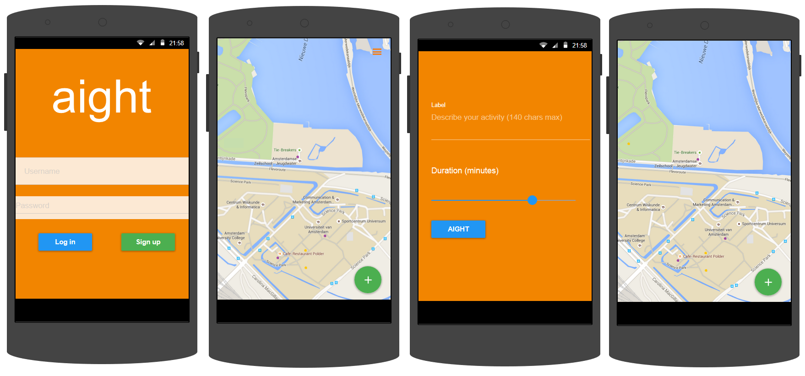

# Aight - Design document
June 5th 2015

## Classes & Methods
To get an idea of the functions of this app, here is an overview of the classes & methods that need to be implemented in order for this app to work properly.

###Activities
**ParseLoginUI** The ParseLoginUI will be used to show a login screen to the user which allows for a login.
Classes:
- Login

**MapsView** The Mapsview will be a fullscreen map presented to the user with dots of events nearby.

**CreateEvent** The createEvent 

## APIs & Frameworks

- Google Maps API
- Parse Login Library API

This app will use the Google Maps API for the MapsView activity. This will be used to show the map to the user. It will also be used to

To enable login, parse will be used. It provides a set of tools which makes it easy to implement log in to the app.

## Sketches

### 2 Main activities: MapsView and CreateEvent
The third activity is LogIn, which is generally only shown at first use. (Left in image below)

 *Left to right: LogIn, MapsView, CreateEvent and Mapsview with new event opened*
### MapsView
Shows current position on the map, zoomed in to a level that you see no more than a 1 km radius around you.
Shows all events that are currently active within the view of the map as clickable dots.
When clicked these dots will expand showing the message that the creator of the event wrote and how much time there is left.
An options menu will be available in the top right corner in which the user can set whether all events or only friends' events should be shown, and it will be possible to log out.

### CreateEvent
In this activity there will be a text box, in which the user can input up to 140 characters on what their intended activity is about. There will be a slider for the duration of the event, which will determine when the event expires and disappears from the map.

### LogIn
The LogIn activity will only show when no login is detected. So generally only the first time a user uses the app on a device. Parse will handle log in.

## Database
Each event a user creates will be stored in a database untill the event expires (maximum of 90 minutes).
Parse will be used as the database, since it offers easy to acces tools for storing and retrieving data.

Two types of data will be stored: User and activity.

**UserData** will be stored holding the username (string), encrypted password (string), and user object id (string).
**ActivityData** will be stored holding the activity's description (string), expiry date (string), whether it is public or private (boolean), and the activity id (string).

## Minimum Viable Product (MVP)

The MVP version of this app allows for a user to log in, view events on the map, and create an event using gps location.
Additional features are the ability to make events either public or private. And to add a settings menu which allows for the option to only show either private, public or both types of events.
