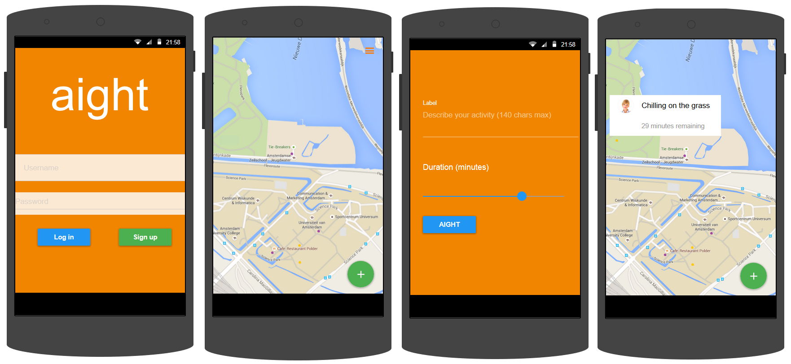

# Aight

## Proposal document

This design document contains all foreseen needed knowledge, methods, data and needed features to create a social app for Android devices with a minimum SDK API level of 7.

## Description
The idea of the app ‘Aight’ is to allow people to meet and enjoy activities together in real life. Often people are open to sharing an activity with anyone. To make this easier, I will make Aight.
Aight shows you your current location on Google maps, with dots of events by friends and public events.
A plus in the  right bottom of the screen will allow you to check in with your current location and create your own event.
For example:
"Chilling here on the grass" Aight?

## Design
The app will use android support library v7 for most of its functionality. It is designed with android 2.1 (API level 7) required as a minimum to run correctly.

## Advantages
- Meet new people
- Save time and chill out
- You don't need to specifically ask people to join you for activities or events.

## Possible complications
- Getting a safe way for people to log in using their phone number might be difficult. 
- Saving activities in a database

## Planning
| Week | Schedule | Features |
|:------:|:------:|---------|
|1 | Prototype UI | Set up views, basic interface elements/controllers, log in, add and see friends. |
|2 | Beta version | Be able to create an activity with your current location |
|3 | Minimum Viable Product | Push notifications, profile view, delayed features |
|4 | Final release | Clean up code and refactor where necessary |

## MVC
### Controller
An onclicklistener will be used to determine what element was clicked (i.e. a specific event or the create new event button)
### Model
The main model is the screen you instantly see: your current location and the dots of activities.

### View
The view will be updated every thirty seconds to look for new events. 

 
## Wireframe

